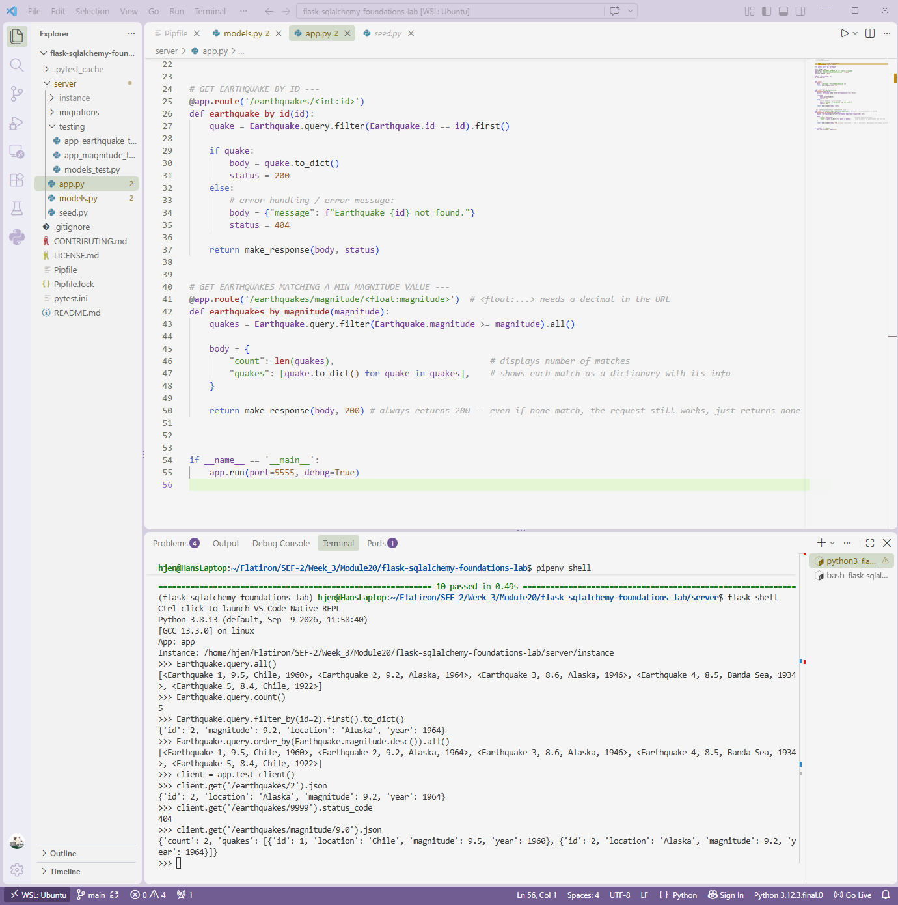

# Flask-SQLAlchemy Lab 1: Earthquake API
**Completed Sept 22, 2026**

A Flask backend for Seismic Analytics Co. that stores earthquake records in a
SQLite database and serves them as JSON. It replaces manual spreadsheet
tracking with an API that frontend tools, such as maps and graphs, can query
by earthquake ID or by minimum magnitude.

## Screenshot
Screenshot of lab in VS Code below shows some sample commands to run in the terminal and shows all 10 tests passed at time of last commit.

## Features

- An `Earthquake` model built with SQLAlchemy (id, magnitude, location, year)
- Database migrations managed with Flask-Migrate
- A seed script that loads 5 historical earthquakes
- Two JSON endpoints that return 200 or 404 depending on the result
- A Pytest suite covering the model and both routes

## Tech Stack

- Python 3.8
- Flask
- Flask-SQLAlchemy
- Flask-Migrate (Alembic)
- SQLite
- Pytest

## Setup

Clone the repo, then install the dependencies and enter the virtual environment:

```bash
pipenv install
pipenv shell
```

Move into the `server` folder and set the Flask environment variables:

```bash
cd server
export FLASK_APP=app.py
export FLASK_RUN_PORT=5555
```

Create the database and load the sample data:

```bash
flask db upgrade head
python seed.py
```

Start the server:

```bash
flask run
```

## API Endpoints

### `GET /earthquakes/<int:id>`

Returns one earthquake by its ID.

`GET /earthquakes/2` returns status **200**:

```json
{
  "id": 2,
  "location": "Alaska",
  "magnitude": 9.2,
  "year": 1964
}
```

`GET /earthquakes/9999` returns status **404**:

```json
{
  "message": "Earthquake 9999 not found."
}
```

### `GET /earthquakes/magnitude/<float:magnitude>`

Returns every earthquake with a magnitude greater than or equal to the given
value, along with a count. The value must include a decimal point (use `9.0`,
not `9`).

`GET /earthquakes/magnitude/9.0` returns status **200**:

```json
{
  "count": 2,
  "quakes": [
    { "id": 1, "location": "Chile", "magnitude": 9.5, "year": 1960 },
    { "id": 2, "location": "Alaska", "magnitude": 9.2, "year": 1964 }
  ]
}
```

If nothing matches, the endpoint still returns 200, with `"count": 0` and an
empty `"quakes"` list.

## Running the Tests

From the `server` folder:

```bash
pytest
```

## Project Structure

```
server/
├── app.py          # Flask app and API routes
├── models.py       # Earthquake model
├── seed.py         # Loads sample earthquake data
├── migrations/     # Flask-Migrate migration scripts
└── testing/        # Pytest test files
```

## Setup Note

The original lock file pinned an older `ipdb` release that failed to build on
some systems (`AttributeError: install_layout`). The `Pipfile` now uses
`ipdb = "*"`, which installs a pre-built version.
